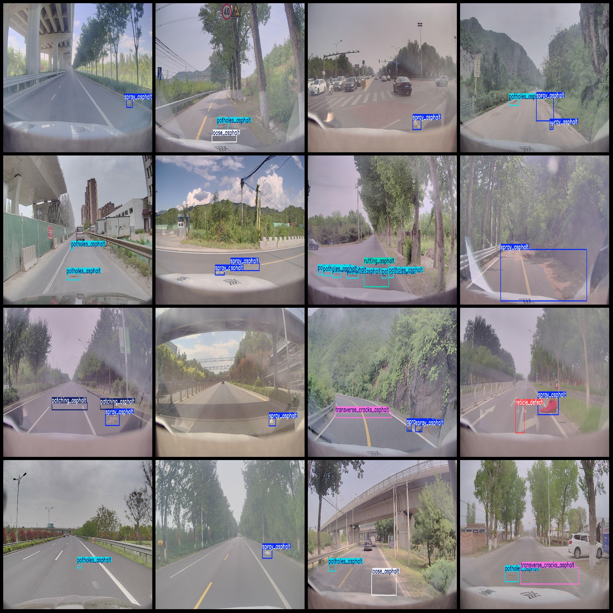
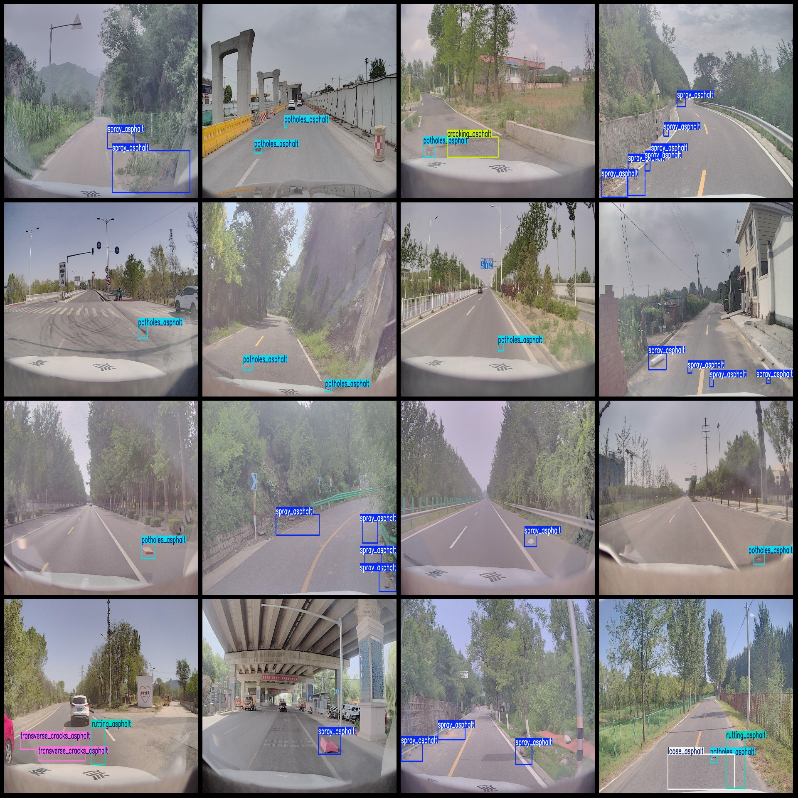

# Traffic Road Surface Abnormal Defects Detection Dataset VOC+YOLO Format with 2362 Images and 20 Categories

The dataset format is Pascal VOC format plus YOLO format (excluding the split path in txt files, containing only jpg images and corresponding VOC format xml files and YOLO format txt files). The number of images (jpg files) is 2362, the number of annotations (xml files) is 2362, and the number of annotations (txt files) is 2362. The number of annotation categories is 20. The label names in the annotation categories are as follows: ["arching_concrete", "barrier_damage", "block_cracks_asphalt", "broken_board_cement", "crack_cement", "cracking_asphalt", "edge_spalling_cement", "joint_material_damage_cement", "longitudinal_cracks_asphalt", "loose_asphalt", "marker_defects", "patching_asphalt", "potholes_asphalt", "potholes_concrete", "reticle_defect", "rutting_asphalt", "spray_asphalt", "subsidence_asphalt", "transverse_cracks_asphalt", "wave_congestion_asphalt"].

Each category has a specified number of bounding boxes:
- arching_concrete : 3
- barrier_damage : 3
- block_cracks_asphalt : 24
- broken_board_cement : 8
- crack_cement : 45
- cracking_asphalt : 208
- edge_spalling_cement : 5
- joint_material_damage_cement : 7
- longitudinal_cracks_asphalt : 175
- loose_asphalt : 125
- marker_defects : 4
- patching_asphalt : 216
- potholes_asphalt : 1369
- potholes_concrete : 13
- reticle_defect : 146
- rutting asphalt (rutting_asphalt): 254
- spray asphalt (spray_asphalt): 2752
- subsidence asphalt (subsidence_asphalt): 9
- transverse cracks asphalt (transverse_cracks_asphalt): 306
- wave congestion asphalt (wave_congestion_asphalt): 1

Total bounding box count: 5673.
Image resolution: 1920x1080.
Annotation tool used: labelImg.
Annotation rules: drawing bounding boxes for each category.
Important note: No provision is made for the accuracy of models trained on this dataset or any weight files.
Image preview:
## Images

Here is a pay link on Stripe ( https://buy.stripe.com/3cs8yP7sY87d0vu9AB ). Please contact me lonlonago@foxmail.com after funding $89, and I will send you a complete data files , thank you!

